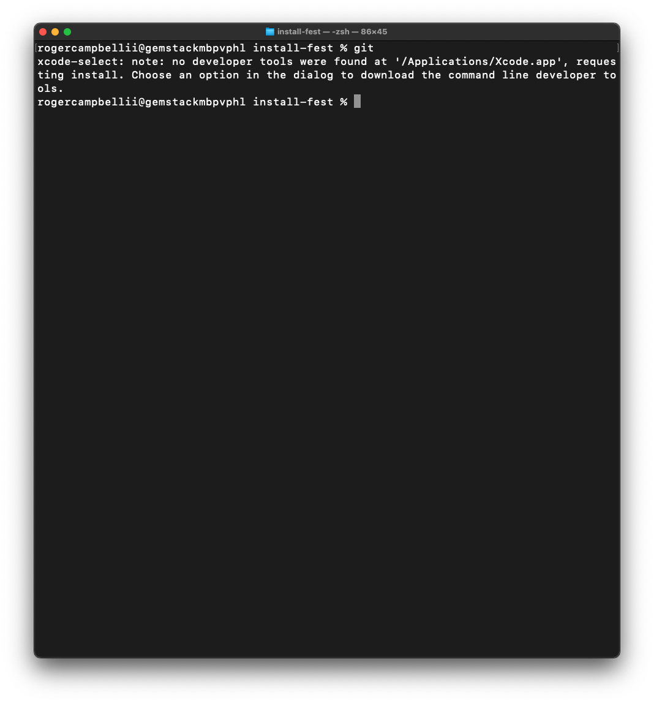
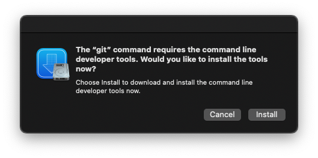
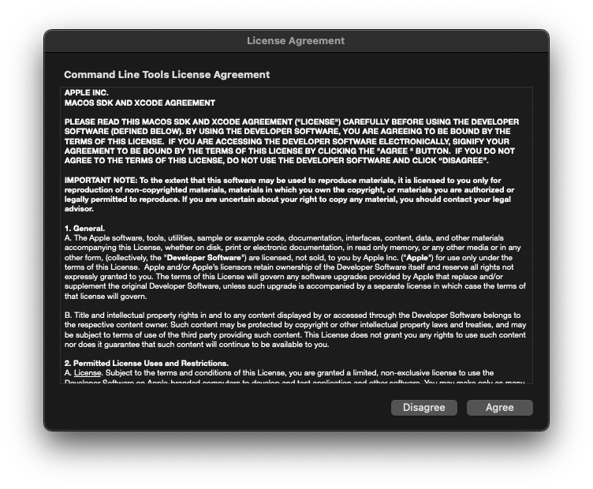

# Installfest

## Google Calendar
1. Go to [Google Calendar](https://calendar.google.com/)
2. Click the three dots in the top right corner
3. Click `More Tools->Create Shortcut`
4. Provide a name for the shortcut
5. Check `Open as window`
6. Click `Create`

## VS Code
1. Go to [Visual Studio Code](https://code.visualstudio.com/download) site and download the required installer for your OS
2. Once VS Code is installed open the program
3. Press `command + shift + p` to open the command pallet
4. Type in `Shell Command: Install 'code' command in PATH` and click the option that appears
    * This will allow you to use the `code` command in the terminal

## Mac Developer Tools
1. Opening the Terminal
2. Type `git`

3. When prompted click `install` 

4. Accept License Agreement


> This install can take anywhere between 10-60 mins

## Check Your Terminal Shell
Move on to this section once the `Mac Developer Tools` download is **finished**.

1. To see which shell your terminal is running:
```sh
$ echo $0

## Output if you are running zsh:
-zsh 

## Output if you are running bash:
-bash 
```

## Set zsh as Default Shell
1. Enter the following command into your terminal:
```sh
chsh -s /bin/zsh
```

### Set Bash as Default Shell
1. Enter the following command into your terminal:
```sh
chsh -s /bin/zsh
```

## Install & Configure Antigen
### Install Antigen
[Antigen](https://github.com/zsh-users/antigen#------antigen-v2) is a plugin manager for zsh.

1. In your root (~) directory create a new hidden directory called `.antigen`:
```sh
cd ~; mkdir .antigen; cd .antigen
```
2. Next install `antigen`:
```sh
curl -L git.io/antigen > antigen.zsh
```

### Configure Antigen
Now we will add in some basic configurations that will run every time you open a new terminal window.

1. Next we will create and configure our `.zshrc` file:
```sh
code ~/.zshrc
```
2. Paste in the following code:
```sh
source ~/.antigen/antigen.zsh

# Load the oh-my-zsh's library.
antigen use oh-my-zsh

# Bundles from the default repo (robbyrussell's oh-my-zsh).
antigen bundle lukechilds/zsh-nvm

antigen bundle git

antigen bundle heroku

antigen bundle pip

antigen bundle lein

antigen bundle command-not-found

# Syntax highlighting bundle.
antigen bundle zsh-users/zsh-syntax-highlighting

# Load the theme.
antigen theme robbyrussell

# Tell Antigen that you're done.
antigen apply
```
3. Restart your terminal which should kick off a bunch of application installtions and you will see your teminal change a bit.

Note that we loaded a theme called `robbyrussell` there are many different themes you can test out and install by changing the name provided in line `antigen theme <NAME OF THEME>` in your `.zshrc` file. You can find an expasive list of themes [here](https://github.com/ohmyzsh/ohmyzsh/wiki/Themes)

## Install Node
Now that we have `antigen` installed and configured it is really easy to install `Node.js`.

1. Enter the following command into your terminal:
```sh
nvm install --lts
```

### Check Node Installation
1. You can check to see if `node` installed properly by running the following command:
```sh
node

## Expected Output:
Welcome to Node.js v16.15.0.
Type ".help" for more information.
> 
```
### Changing Node Versions
Be mindful that the install command in the section above will install the latest version of `Node.js` which might not be what you want. If for some reason you would like to change your the version of `Node` you are running you can use the following command:
```sh
nvm use 0.00.0
```

## GitHub SSH Keys
### Generating SSH Keys
1. Generate a SSH Key:
```sh
$ ssh-keygen -t -C "your_name@email.com"

ssh-keygen -t -C "mr@rogercampbell.io"
```
2. When prompted provide a location and name for your SSH Key
```sh
# Prompt Message: Enter file in which to save the key (/Users/rogercampbellii/.ssh/id_ed25519):

# Your Input:
/Users/rogercampbellii/.ssh/<NAME OF SSH KEY>
/Users/rogercampbellii/.ssh/personal-mrrogercampbell
```
3. When prompted to `Enter passphrase` just hit enter twice
4. Verify your SSH Key was properly created:
```sh
$ ls ~/.ssh

# Expected output:
<NAME OF SSH KEY>     <NAME OF SSH KEY>.pub

# Example Output:
personal-mrrogercampbell     personal-mrrogercampbell.pub
```
### Adding SSH Key to the ssh-agent
1. Start the `ssh-agent`:
```sh
$ eval "$(ssh-agent -s)"

# Expected Output:
Agent pid 10374
```
2. Load your SSH key:
```sh
$ ssh-add ~/.ssh/personal-mrrogercampbell
```

### Add Your SSH Key to your Github Accounts
1. Copy your SSH key:
```sh
pbcopy < ~/.ssh/<Name of Your SSH Key>.pub
```
2. Go to [GitHub](https://github.com/)
3. Click your profile picture on the top right of the page
4. Click `Settings`
5. In the `Access` section of the right click `SSH and GPG keys`
6. Click `New SSH key`
7. Provide a `Title`; could be the name of your computer
8. Paste in the Key we copied in step 1
9. Click `Add SSH key`
10. Provide your GitHub Password when prompted

### Confirming Your Connection
1. Run the following command:
```sh
ssh -T git@github.com
```
2. If prompted with the following message enter yes:
```sh
# Are you sure you want to continue connecting (yes/no/[fingerprint])?
$ yes

# Expected Output
# Warning: Permanently added 'github.com' (ED25519) to the list of known hosts.
# Hi <GitHub Username>! You've successfully authenticated, but GitHub does not provide shell access.
```
## Configuring Two Sets of SSH Keys
1. In order to do this complete all sections with in `GitHub SSH Keys` for each GitHub account you need to work with
2. Open your `.zshrc` file
```sh
code ~/.zshrc
```
3. Create the following alais:
```sh
alias sshc="ssh-add -D; ssh-add ~/.ssh/<Name of SSH Key>"

# Alais syntax breakdown
alias <custom-alias-name>=”<command>”
```
> You will need to do this for each SSH Key you want to utilize
```sh
# Examples:
# This removes any existing ssh key from the ssh-agent and adds my work ssh key
alias sshwork="ssh-add -D; ssh-add ~/.ssh/work"

# This removes any existing ssh key from the ssh-agent and adds my personal ssh key
alias sshp="ssh-add -D; ssh-add ~/.ssh/personal"

# This is list all alias loaded in the ssh-agent
alias chkssh="ssh-add -l;"
```

## Configure Git
git config --global user.name "mrrogercampbell"
git config --global user.email "mr@rogercampbell.io"

git config --global user.name "mrrocampbel"
git config --global user.email "rocampbell@chegg.com" 


## References
* [How to configure and use aliases in ZSH - Linux Hint](https://linuxhint.com/configure-use-aliases-zsh/)
* [Generating a new SSH key and adding it to the ssh-agent - GitHub](https://docs.github.com/en/authentication/connecting-to-github-with-ssh/generating-a-new-ssh-key-and-adding-it-to-the-ssh-agent)
* [Multiple SSH Keys settings for different github account](https://gist.github.com/jexchan/2351996) - didn't work
* [How to install Node.js and NPM with MacOS’s new zsh terminal - AJ Keller](https://medium.com/@andrewjaykeller/how-to-install-node-js-and-npm-with-macoss-new-terminal-zsh-e39b4a62d3d4)
